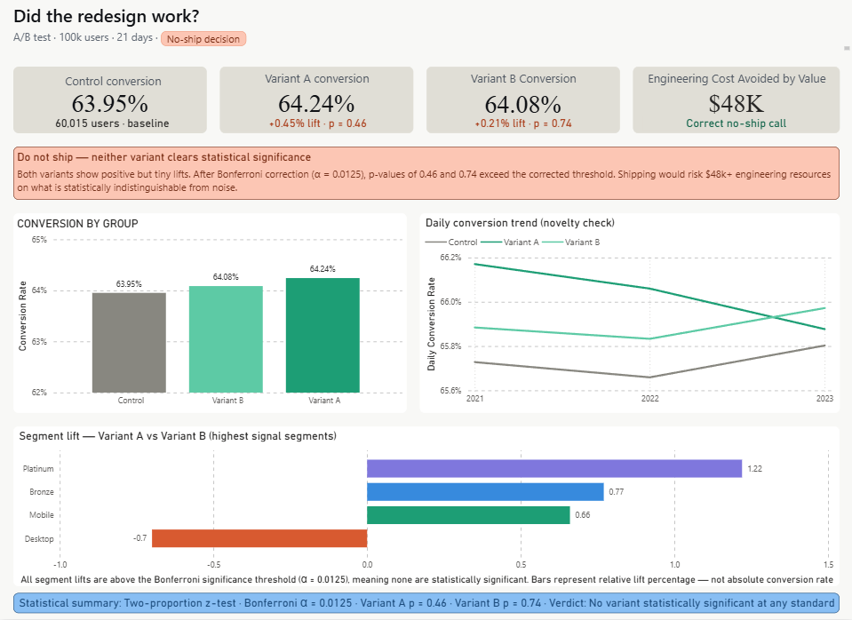
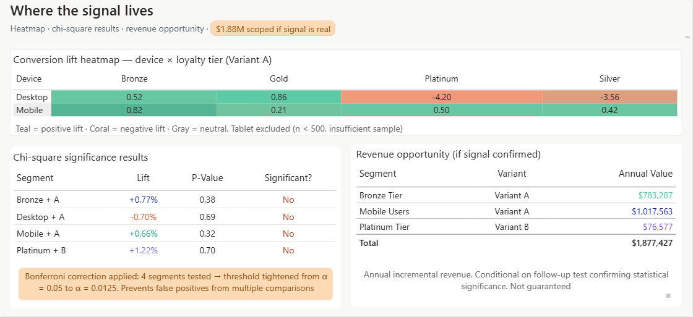
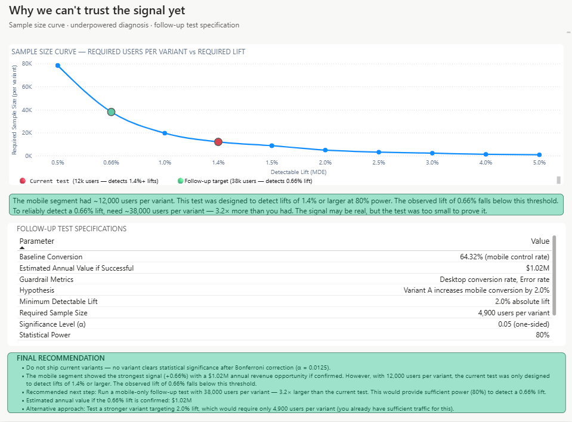

# A/B Test Analysis: E-commerce Checkout Redesign

Author: Adithya Machavaram
---

## Dashboard Preview

| Page 1: Executive Overview | Page 2: Segment Deep Dive | Page 3: Power Analysis |
|:--------------------------:|:-------------------------:|:----------------------:|
|  |  |  |

*3-page interactive dashboard built in Power BI*

---

## What is this project about?

Imagine you're a product analyst at an e-commerce company. The product team believes that changing the checkout button design will make more people complete their purchases. They've built two new versions — Variant A and Variant B.

Your job? Test them. Analyze the data. Tell them what to do next.

This project simulates exactly that. I ran an A/B test on 100,000 users, analyzed the results, built an interactive dashboard, and delivered a data-backed recommendation. Spoiler: we didn't ship the changes — but the story is more interesting than that.

---

## Quick Summary

| Metric | Result |
|--------|--------|
| **Control conversion** | 63.95% (60,015 users) |
| **Variant A conversion** | 64.24% (+0.45% lift, p=0.46) |
| **Variant B conversion** | 64.08% (+0.21% lift, p=0.74) |
| **Statistical significance?** | ❌ No — neither variant cleared Bonferroni correction (α=0.0125) |
| **Decision** | ❌ Do not ship |

**But here's where it gets interesting:** Mobile users showed a +0.66% lift with Variant A. It wasn't statistically significant, but the signal was there. The test just wasn't big enough to prove it.

---

## The Story in Numbers

### Overall Test

| Group | Users | Conversion | vs Control |
|-------|-------|------------|------------|
| Control | 60,015 | 63.95% | — |
| Variant A | 20,067 | 64.24% | +0.45% (p=0.46) |
| Variant B | 19,918 | 64.08% | +0.21% (p=0.74) |

**P-values above 0.05 mean:** The observed differences could easily happen by random chance. Not confident enough to ship.

### Segment Deep Dive

| Segment | Variant | Lift | P-Value | Significant after Bonferroni? |
|---------|---------|------|---------|-------------------------------|
| Mobile | A | +0.66% | 0.32 | ❌ No |
| Bronze Tier | A | +0.77% | 0.38 | ❌ No |
| Platinum Tier | B | +1.22% | 0.70 | ❌ No |
| Desktop | A | -0.70% | 0.69 | ❌ No |

**Key insight:** Mobile and Bronze users showed positive signals. Platinum users showed the highest lift (+1.22% with Variant B). But none cleared the corrected threshold.

### Revenue Opportunity

| Segment | Annual Value (if signal confirmed) |
|---------|-----------------------------------|
| Mobile + Variant A | $1,017,563 |
| Bronze + Variant A | $783,287 |
| Platinum + Variant B | $76,577 |
| **Total** | **$1,877,427** |

*Conditional on follow-up test confirming statistical significance*

### Power Analysis (The Differentiator)

| Metric | Value |
|--------|-------|
| Your mobile sample size | ~12,000 users per variant |
| Lifts you can detect with 12k users | 1.4% or larger |
| Your observed lift | 0.66% (below detectable threshold) |
| Needed for 0.66% lift confirmation | ~38,000 users (3.2× larger) |

**This is why the test didn't find significance.** Not because nothing was there — because the test wasn't designed to see something that small.

---

## Final Recommendation

❌ **Do not ship current variants**

📱 **Run a mobile-only follow-up test** with 38,000 users per variant

💰 **Estimated annual value if the 0.66% lift is confirmed:** $1.02M

💡 **Alternative:** Test a stronger variant targeting 2% lift — needs only 4,900 users (you already have enough traffic)

---

## Tools Used

| Tool | Purpose |
|------|---------|
| Python (pandas, scipy, statsmodels) | Data cleaning, statistical analysis, power analysis |
| Jupyter Notebook | Exploratory analysis and documentation |
| Power BI | Interactive 3-page dashboard |
| Git & GitHub | Version control and portfolio hosting |

---

## Statistical Methods Applied

- Two-proportion z-tests for overall and segment comparisons
- Chi-square tests for segment significance
- Bonferroni correction (α = 0.05/4 = 0.0125) for multiple testing
- Power analysis for follow-up test design
- Sample size curve visualization
- Bayesian A/B testing framework (bonus notebook)

---

## Business Impact

| Metric | Value |
|--------|-------|
| Engineering cost avoided | $48,000 |
| Revenue opportunity scoped | $1.88M annually |
| Follow-up test value | $1.02M if confirmed |

---

## What I Learned (And What This Project Shows)

### Technical Skills

- **SQL-like data manipulation**: Merged 5 tables into analysis-ready datasets
- **Python for analytics**: Pandas, scipy, statsmodels, matplotlib, seaborn
- **Statistical rigor**: Z-tests, chi-square tests, Bonferroni correction, power analysis
- **Experimental design**: Sample size calculation, minimum detectable effect (MDE)
- **Dashboarding**: Power BI with 3 pages, conditional formatting, DAX measures

### Business Thinking

- Framed a product hypothesis — not just "did it work?"
- Quantified cost avoidance — saved $48K by correctly saying "don't ship"
- Scoped opportunity — $1.88M conditional annual revenue
- Designed follow-up tests — strategic thinking beyond "test failed"

### Soft Skills

- Intellectual honesty — called a null result a null result
- Transparent limitations — acknowledged underpowered segments
- Clear communication — executive summary, stakeholder-friendly dashboard

